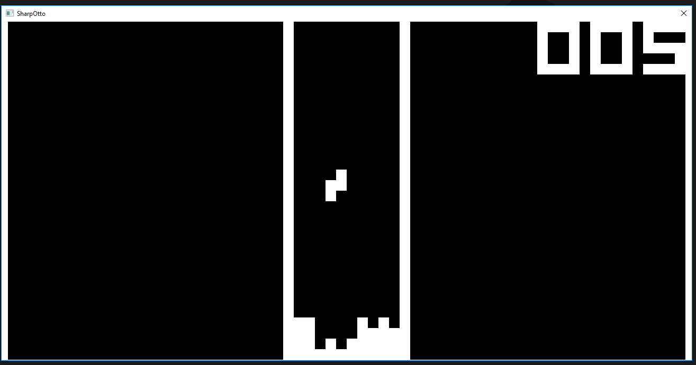

# SharpOtto 

Simple Chip-8 emulator written in C# .NET Core.
Tetris is loaded by default, use the num pad keys to control the game.

Tetris:

Maze:

## Resources

- http://devernay.free.fr/hacks/chip8/C8TECH10.HTM
- http://www.multigesture.net/articles/how-to-write-an-emulator-chip-8-interpreter/